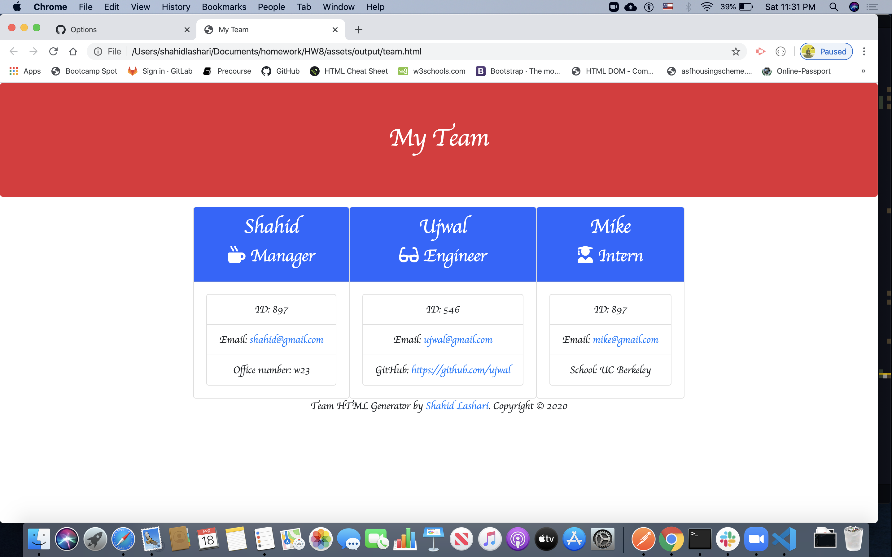

# Team Profile Generator

**URL**
https://github.com/shahidlashari/HW8

https://shahidlashari.github.io/HW8/

## Description

* The Team Profile Generator is a command-line-input application run in Node that requests information from the user about members of an engineering team and generates an HTML file displaying that information. Before running the application the user must perform an npm install to install all required dependencies.

## User Story

* Upon launching the app, the user is asked to develop his team. The user is prompted the options to select the member's role from a list (options include "Engineer," "Intern," and "Manager), enters the member's ID (any string), enters the member's email address, and then must enter another piece of information that will differ depending on what role was selected. If "Engineer" was selected, the app asks the user for the member's GitHub username; if "Intern" was selected, the member's school is requested; and if "Manager" was chosen, the user is prompted for the manager's office number.When all information on the team member has been entered, the user is asked whether there are any more members they would like to add. If so, the user is asked the same questions about the new team member. If not, an HTML file is created with cards displaying the information on all the team members entered by the user in the "output" folder titled "team.html.

## Techniques Used:

### Object-Oriented Programming

* This app was created using Object-Oriented Programming concepts, namely using classes and constructors to create "team member" objects based on information entered by the user. The app is run using Node.js, and uses the "Inquirer" and "FS" node modules. Files for different objects are also stored in separate .js files and passed among one another using module.exports and require.

### Test-Driven Development

* This app uses concepts from Test-Driven Development. Jest is used to perform tests on all the class constructors to ensure that they behave as expected. The FS node module is used to generate an HTML file from strings written in JavaScript. Since the app will work no matter how many team members the user adds to the system, the HTML is built in a piecemeal fashion, starting with the head and part of the body. For each team member object created, a new column with a card inside containing the team member information is added. Then when the last member has been added, the last bit of the HTML is added to the file. 

## Technologies:-

    * HTML
    * CSS 
    * JQuery
    * Bootstrap
    * Visual Studio Code
    * NPM(Inquirer, fs, jest, package json)

## Challenges:-

* This activity was difficult it took a lot of time to test each member's file using npm run test. I started my pseudo-code to work with. I went through lecture videos and also looking through a couple of examples online in order to understand jQuery code and day,date and time functions. Most difficult part was to avoid DRY and prompt questions once and select specific informations as per role. 

* This activity was difficult it took a lot of time to test each member's file using npm run test. I started my pseudo-code to work with. I went through lecture videos and also looking through a couple of examples online in order to understand jQuery code and day,date and time functions.

